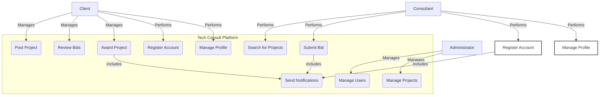

# Case Study: Chapter 7 - System Modeling

## 7.1 The Purpose of Modeling

System modeling is crucial for the Tech Consult Platform project to provide clear, visual representations of the system's functionality and structure. These models serve as a communication tool for all stakeholders, from developers to investors, ensuring everyone has a shared understanding of what we are building. For this case study, we will use text and Mermaid syntax to represent key UML diagrams.

## 7.2 Use Case Diagram

The Use Case diagram illustrates the interactions between users (actors) and the main functions of the system.

**Actors:**
-   **Client:** A person or company looking to hire tech talent.
-   **Consultant:** A technology professional looking for work.
-   **Administrator:** A platform operator.

**Diagram (using Mermaid Syntax):**


*Note: The Mermaid diagram above shows that both Clients and Consultants can register and manage profiles. Clients are responsible for posting projects and managing the bidding process. Consultants search for projects and submit bids. Administrators have oversight functions. Key actions trigger notifications.*

## 7.3 Component Diagram

The Component diagram provides a high-level view of the system's architecture, showing the main software components and their relationships.

**Components:**
-   **Frontend:** A React-based Single-Page Application (SPA) that runs in the user's browser.
-   **Backend:** A Django-based application server that exposes a REST API.
-   **Database:** A PostgreSQL database for persistent data storage.

**Diagram (using Mermaid Syntax):**

```mermaid
graph TD
    subgraph "Browser"
        Frontend[<--> Frontend <br> (React SPA)]
    end

    subgraph "Server Infrastructure"
        Backend[<--> Backend <br> (Django REST API)]
        Database[(Database <br> (PostgreSQL))]
    end

    Frontend -- "HTTPS/REST API" --> Backend
    Backend -- "SQL" --> Database
```
*Note: This diagram shows the three primary components of our system. The **Frontend** communicates with the **Backend** exclusively through a secure REST API over HTTPS. The **Backend** is the only component that has direct access to the **Database**, enforcing a clear separation of concerns.*

These models provide a solid foundation for the technical team to begin detailed design and implementation, ensuring that the final product is aligned with the project's requirements.
