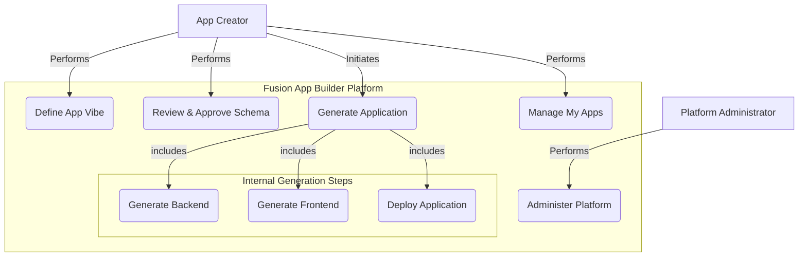
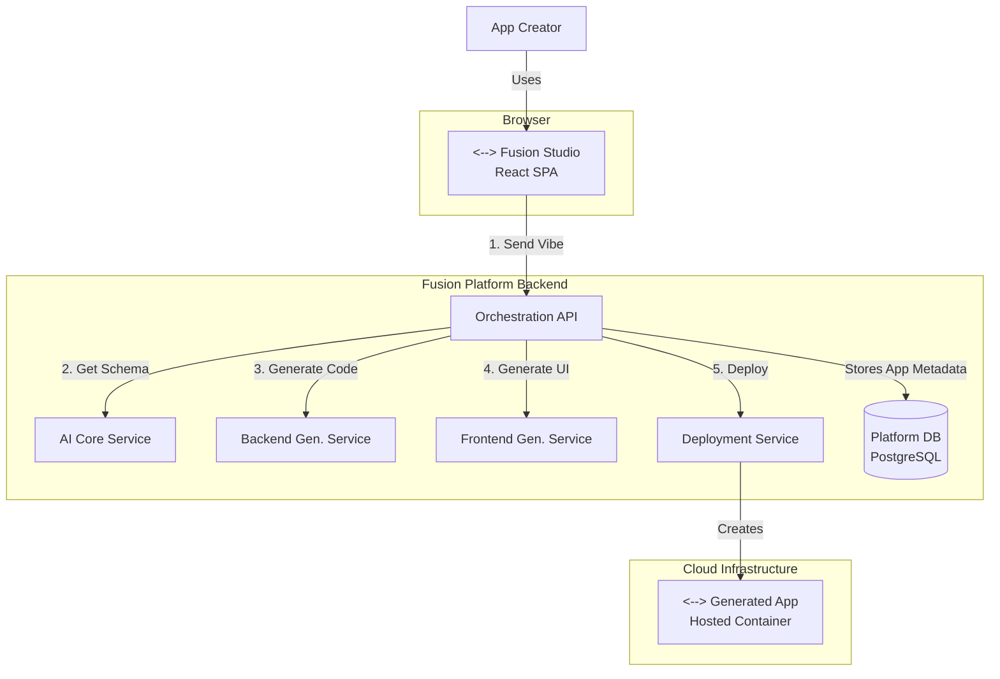

# App Builder Case Study: Chapter 7 - System Modeling

## 7.1 The Purpose of Modeling

For "Project Fusion," system models are essential for understanding the two levels of the system: the user's experience in the "Studio" and the complex pipeline of services that work behind the scenes to generate an application. The following diagrams use Mermaid syntax to visualize these aspects.

## 7.2 Use Case Diagram

This diagram illustrates the primary functions of the Fusion platform from the perspective of its users.

**Actors:**
-   **App Creator:** The internal employee building an application.
-   **Platform Administrator:** The IT user who manages the Fusion platform.

**Diagram (using Mermaid Syntax):**

*Note: The diagram shows the App Creator's journey from defining the "vibe" to managing their created apps. The `Generate Application` use case is a high-level function that includes the three core internal steps: generating the backend, frontend, and deploying the result.*

## 7.3 Component Diagram

This diagram details the microservices architecture of the Fusion platform itself.

**Components:**
-   **Fusion Studio:** The user-facing React SPA.
-   **Orchestration API:** The main backend API that the Studio talks to.
-   **AI Core Service:** A specialized service for NLP and schema generation.
-   **Code Generation Services:** Separate services for generating backend (Django) and frontend (React) code.
-   **Deployment Service:** A service that interfaces with the cloud provider to deploy the generated code.
-   **Platform DB:** PostgreSQL database for the Fusion platform itself.

**Diagram (using Mermaid Syntax):**

*Note: This diagram shows the complex workflow orchestrated by the main **Orchestration API**. The **Studio** sends the user's "vibe" (1). The orchestrator calls the **AI Core Service** to get a schema (2). It then calls the **Backend** (3) and **Frontend** (4) generation services. Finally, it tells the **Deployment Service** to deploy the new application (5). The **Platform DB** stores metadata about the apps created.*

These models clearly separate the user's simple experience from the complex, multi-service pipeline that powers the platform.
