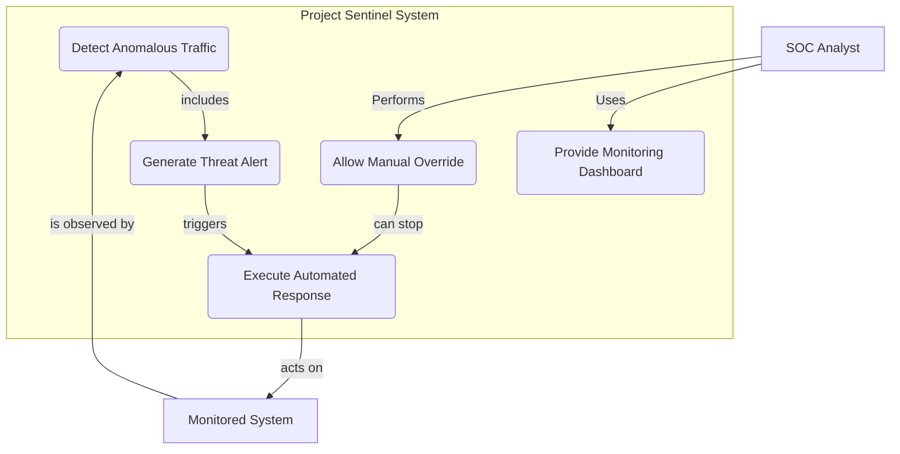
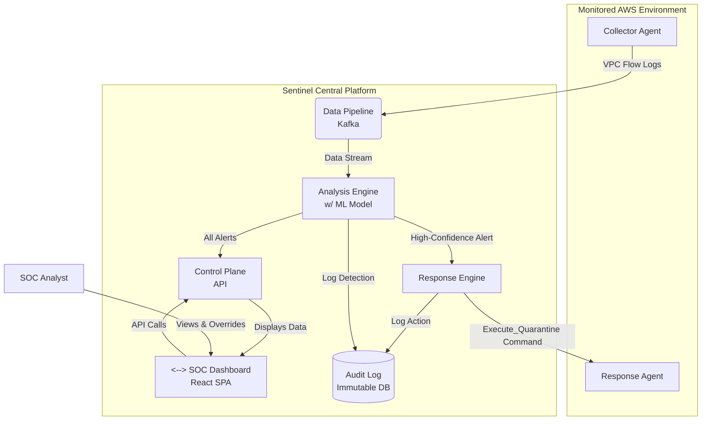

# Cybersecurity Case Study: Chapter 7 - System Modeling

## 7.1 The Purpose of Modeling

For a distributed and autonomous system like "Project Sentinel," system modeling is not just helpful—it is essential. The following models provide a clear and unambiguous representation of the system's behavior and structure, which is critical for architects, developers, and security analysts to have a shared understanding. We will use Mermaid syntax to represent these models.

## 7.2 Use Case Diagram

This diagram illustrates the high-level interactions between the system's users (the SOC Analyst) and the system itself, treating the core autonomous functions as primary use cases.

**Actors:**
-   **SOC Analyst:** The human operator supervising the system.
-   **Monitored System:** The enterprise AWS environment that the system observes and acts upon.

**Diagram (using Mermaid Syntax):**

*Note: This diagram shows that the core of the system is the autonomous detection and response loop (`UC1`, `UC2`, `UC3`). The `SOC Analyst` interacts with the system primarily through the monitoring dashboard (`UC4`) and has the critical ability to override the automated response (`UC5`).*

## 7.3 Component Diagram

This diagram details the major software components of the Project Sentinel architecture and how they interact at runtime.

**Components:**
-   **Collector Agent:** Lightweight agent deployed on network endpoints.
-   **Data Pipeline:** A Kafka cluster for high-throughput data ingestion.
-   **Analysis Engine:** A service that runs the ML model for threat detection.
-   **Response Engine:** A service that orchestrates the response actions.
-   **Response Agent:** Agent deployed on endpoints to execute actions.
-   **Control Plane:** The central API and backend for the dashboard.
-   **SOC Dashboard:** The React-based frontend for the SOC Analyst.
-   **Audit Log:** A secure database for logging all actions.

**Diagram (using Mermaid Syntax):**

*Note: This diagram illustrates the data flow: **Collector Agents** send logs to the **Data Pipeline**. The **Analysis Engine** consumes this data, sending alerts to the **Response Engine** (for action) and the **Control Plane** (for display). The **Response Engine** commands the **Response Agent** to act. The **SOC Analyst** interacts with the system via the **Dashboard**, which communicates with the **Control Plane**. All significant events are logged to the **Audit Log**.*

These models provide the architectural blueprint necessary for the development teams to build, test, and deploy Project Sentinel effectively.
