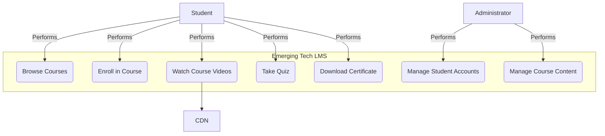

# LMS Case Study: Chapter 7 - System Modeling

## 7.1 The Purpose of Modeling

For the "Emerging Tech LMS" project, creating abstract models is essential to communicate the system's design. These models provide a clear, shared understanding of the system's functions and technical structure for the entire team and all stakeholders. We will use text and Mermaid syntax to represent these key UML diagrams.

## 7.2 Use Case Diagram

This diagram shows the interactions between the system's users (actors) and its primary features.

**Actors:**
-   **Student:** The primary learner using the platform.
-   **Administrator:** An internal user responsible for platform and content management.
-   **CDN (Content Delivery Network):** An external system that serves video content.

**Diagram (using Mermaid Syntax):**


*Note: The diagram illustrates the two main user roles. The **Student** interacts with all the learning-related features, from browsing to getting a certificate. The `Watch Course Videos` use case has a dependency on the external **CDN**. The **Administrator** has oversight functions for managing both students and the course content itself.*

## 7.3 Component Diagram

This diagram shows the high-level software components and their interconnections, providing a blueprint for the system's architecture.

**Components:**
-   **Frontend:** The React SPA that the student interacts with.
-   **Backend:** The Django REST API that handles all business logic.
-   **Database:** The PostgreSQL database for data persistence.
-   **Video Service:** An internal backend service responsible for managing video metadata and providing secure URLs for video access.

**Diagram (using Mermaid Syntax):**

```mermaid
graph TD
    subgraph "Browser"
        Frontend[<--> Frontend <br> (React SPA)]
    end

    subgraph "Server Infrastructure"
        Backend[<--> Backend <br> (Django REST API)]
        Database[(Database <br> (PostgreSQL))]
        VideoService[<--> Video Service]
    end

    subgraph "External Services"
        CDN[(CDN <br> e.g., AWS CloudFront)]
    end

    Frontend -- "HTTPS/REST API" --> Backend
    Backend -- "SQL" --> Database
    Backend -- "Internal Call" --> VideoService
    VideoService -- "Provides Secure URL" --> Frontend
    Frontend -- "HTTP GET" --> CDN
```
*Note: This diagram shows a slightly more detailed architecture. The **Frontend** communicates with the main **Backend** API for most data. For video playback, the Backend calls a specialized internal **Video Service**, which generates a secure, time-limited URL for a video file. This URL is passed to the Frontend, which then directly streams the video from the **CDN**. This common pattern enhances security and performance.*

These models create a clear and unambiguous guide for the development team, ensuring the final product aligns with the project's functional and architectural requirements.
